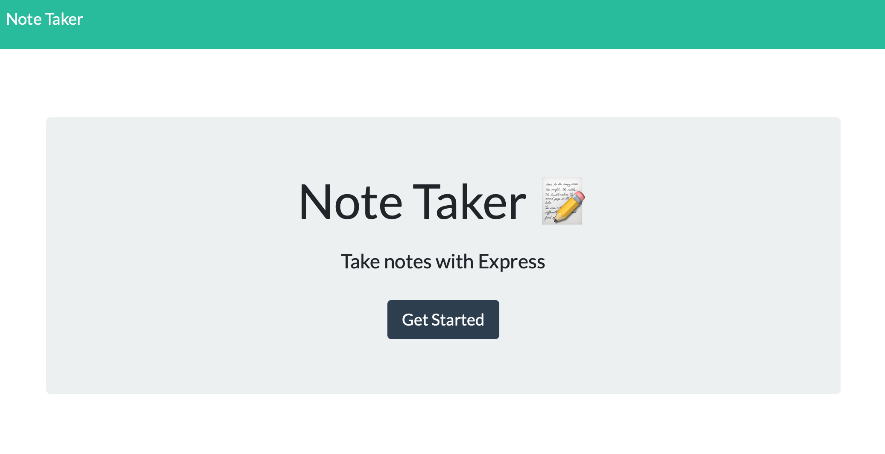
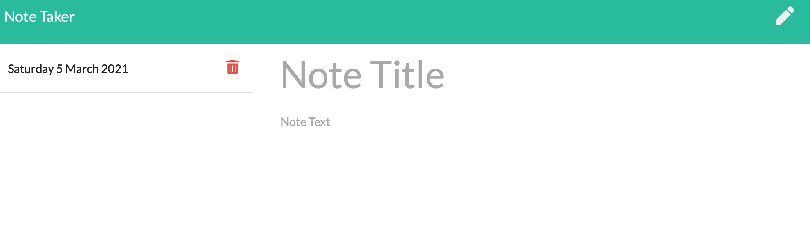

# Note Taker

 

As a user I want to be able to write, save or delete notes to my app. I will be able to enter as many notes as I would like and will be able to delete the notes once I've finished my task.

Table of Contents
* [Usage](#Usage)
* [License](#License)
* [Questions](#Questions)

## Usage
* Used the Express & uuid npm packages
* Deployed final app to Heroku

## GitHub Live Site Deployed on Heroku
* Heroku: [Note Taker Heroku](https://write-notes-marisa.herokuapp.com/)

## GitHub Repo Link
* GitHub: [Note Taker GitHub Repo](https://github.com/marisanesmith/note_taker)

## License

You can find out more about the MIT license on the open source page [here](https://www.opensource.org/licenses/MIT)

## Questions

Please contact me via email if you have any questions about this application.

* GitHub Profile: [github.com/marisanesmith](https://github.com/marisanesmith)

* Email: [marisanesmith@yahoo.com](marisanesmith@yahoo.com)